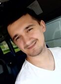

# Vlad Choporov

## Goal and Wishes

I want to gain more commercial experience and improve myself as a specialist.
At the same time, I want improve my English. Why?

Because after a while I don't lose interest in this activity and I want to consume the content in the original.

___

## Contact info
  * M. number: __+375(33) 696-25-29 _mts___.
  * Vk: https://vk.com/vlad_choporov.
  * GitHub: https://github.com/Vladachi8.

  ___

## Education
* Vitebsk State Polytechnic College. Specialty Software Technician.
* Vitebsk State Technological University. Specialty Software Engineer.
* Epam performance engineer course certificate
* RsSchool web

## Languages
* English B1.
* Deutsch B1 Goethe certificate.
* Russian native

___
## IT Skills
  1. Html, СSS, Git, VanillaJS, TypeScript
  1. nodeJs, React
  1. Performance monitor, jMeter

## IT Experience
  I can do website with styles and JS logic, also have experience in solving algorithmic problems and testing them with framework MOCHA. I used to with JMeter and system load, a little bit experience with PHP.

  * [RS School](https://app.rs.school/profile#view)
  * [codewars](https://www.codewars.com/users/Vladachi8)
  * [GitHub](https://github.com/Vladachi8)

## Code examples
layout and algorithmic tasks on my [GitHub](https://github.com/Vladachi8).

___
## About Me
  I'm about 30. Human and task oriented, lived and worked in Europe, 8 years in social dance, have experience in teaching, organizer of entertaining social events, the largest of which was for 100+ people.

___
___

