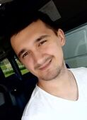

# Vlad Choporov

## Goal and Wishes

I'm studying web programming now and i'd like to continue this, progressing as a specialist.
At the same time, I want much higher improve my English too. Why?
I want to qualitatively change my life.

___

## Contact info
  * M. number: __+375(33) 696-25-29 _mts___.
  * Vk: https://vk.com/vlad_choporov.
  * GitHub: https://github.com/Vladachi8.

  ___

## Education
* Vitebsk State Polytechnic College. Specialty Software Technician.
* Vitebsk State Technological University. Specialty Software Engineer.
* Epam performance engineer course certificate
* RsSchool web

## Languages
* English A2+.
* Deutsch B1 Goethe certificate.
* Russian native

___
## IT Skills
  1. Html, СSS, Git, VanillaJS
  1. nodeJs, React
  1. Performance monitor, jMeter

## IT Experience
  * [RS School](https://app.rs.school/profile#view)
  * [codewars](https://www.codewars.com/users/Vladachi8)
  * [GitHub](https://github.com/Vladachi8)

## Code examples
layout and algorithmic tasks on my [GitHub](https://github.com/Vladachi8).

___
## About Me
  I'm 27. Human and task oriented, lived and worked in Europe, 4 years engaged in social dancing, taught a little, friendly, responsible, purposeful

___
___

